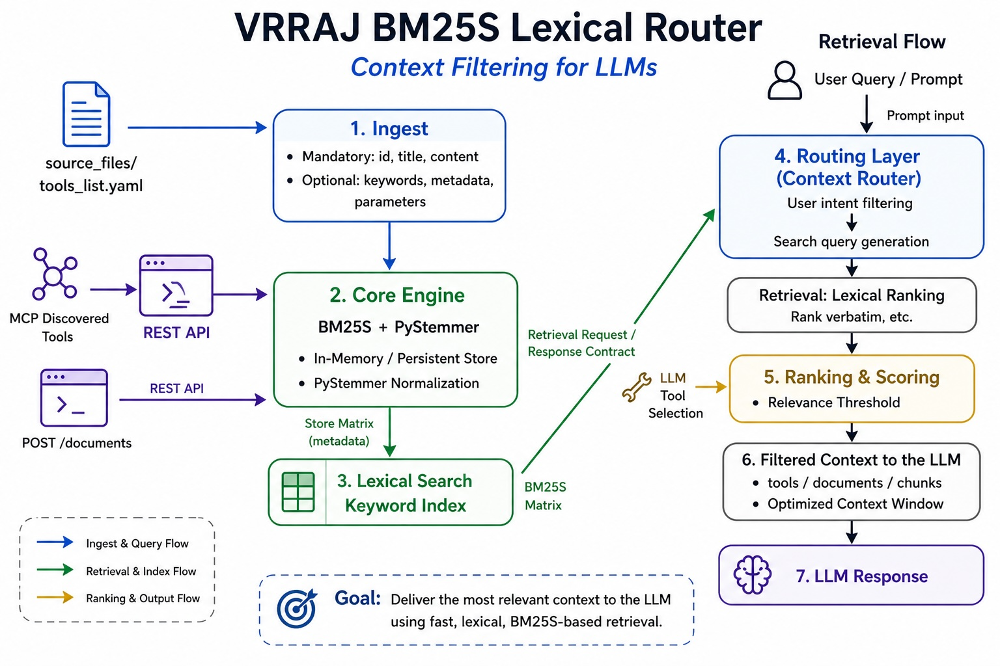

# vrraj-bm25s-retriever

[](https://pypi.org/project/vrraj-bm25s-retriever/)
[](https://github.com/vrraj/bm25s-retriever/releases)


> **Development and Demo UI:**  
> This repository ships with a FastAPI-powered **Interactive Web Interface** for testing BM25S document retrieval, managing document collections, and configuring search parameters. See **[Development And Demo UI](#development-and-demo-ui)** section below for details and setup instructions.

A lightweight BM25S-powered retrieval package with **Python API, REST service, and demo UI** for lexical search, indexing, and management with **normalized outputs** (scores, rankings, metadata).

Positioned as a **lexical routing layer for LLM systems**, enabling efficient context filtering across tools, documents, and chunked data.


Built for fast lexical retrieval using BM25S and PyStemmer, with stemming, softmax relevance scoring, configurable filtering, and a clean response schema for application integration — optimized for LLM context control, tool routing, and hybrid RAG pipelines.




<center>*Figure: BM25S Retriever LLM architecture for tool routing and context filtering*</center>


## Use Cases: LLM Tool Routing and Hybrid Retrieval

This package is primarily designed for **LLM-driven systems** where controlling tool/context exposure is critical.

### 1. Tool Filtering for LLMs (Primary Use Case)
In domain-specific systems (trading, customer support, CRM, finance, operations), user intent is typically narrow and well-defined.

Instead of exposing the full tool registry to the LLM, BM25S can be used to:

- Retrieve only the **most relevant tools** for a given user query
- Reduce **tool context bloat** in prompts
- Minimize **LLM confusion across similar tools**
- Lower **token usage and cost**
- Enforce **guardrails and permissions** by controlling which tools are surfaced

This fits naturally into a pipeline:

```
User Query → BM25S Retrieval → Filtered Tool Set → LLM Tool Selection → Execution
```

### 2. Domain-Constrained Retrieval
For structured domains like:
- Trading / market data
- Customer support workflows
- CRM operations
- Financial systems

BM25S enables fast lexical matching against curated tool/document sets, ensuring the LLM operates within a **tight, relevant context window**.

### 3. Hybrid RAG (Lexical + Semantic)
While BM25S is lexical, it can complement semantic retrieval systems:

- Use BM25S for **high-precision keyword matching**
- Combine with embeddings for **semantic recall**
- Merge results for a **hybrid RAG pipeline**

This is especially useful when:
- Exact terms matter (tickers, IDs, commands)
- Semantic models may miss domain-specific keywords

### 4. Lightweight Retrieval Layer
For many applications, full vector search infrastructure is unnecessary.

BM25S + PyStemmer provides:
- Fast in-memory lexical retrieval
- Stemming-aware matching for better recall across word variants
- Simple setup (no external DB required)
- Deterministic, explainable scoring

Ideal for:
- Tool selection layers
- Small-to-medium document sets
- Low-latency applications

- **PyPI:** https://pypi.org/project/vrraj-bm25s-retriever
- **GitHub:** https://github.com/vrraj/bm25s-retriever
- **Documentation:** https://vrraj.github.io/bm25s-retriever/

## Install

```bash
pip install vrraj-bm25s-retriever
```

## What you get
- **BM25S retrieval library** for programmatic lexical document and tool search
- **HTTP client API** for remote service integration
- **Softmax scoring** with temperature-controlled relevance
- **Configurable filtering** (zero-relevance, cutoff thresholds)
- **Document management** via Python API or HTTP client
- **Normalized response format** across all interfaces
- **Demo Web Interface** for testing and development (GitHub only)

> **Primary use case:** Programmatic lexical retrieval via Python API
> 
> **Secondary use case:** HTTP client API for remote service integration

### Option A: Direct Library Usage (Recommended)

```python
from bm25s_retriever import BM25SRetriever, Document

# Create retriever instance
retriever = BM25SRetriever()

# Add documents programmatically
doc = Document(
    id="doc1",
    title="Financial Planning Guide", 
    content="Comprehensive guide to personal financial planning",
    keywords=["finance", "planning", "investment"]
)

retriever.add_documents([doc])

# Search documents
results = retriever.retrieve_documents("investment strategies")
for doc in results['documents']:
    print(f"{doc['title']}: {doc['bm25_score']:.2f}")
```

### Option B: HTTP Client API

```python
from bm25s_retriever import BM25SClient

client = BM25SClient("http://localhost:9200")

# Search documents
results = client.retrieve("cryptocurrency data")
print(f"Found {len(results['documents'])} documents")

# Add a document
client.add_document({
    "id": "my_doc",
    "title": "My Document",
    "content": "Document content here...",
    "keywords": ["keyword1", "keyword2"]
})
```

### Option C: Ready-to-use Example Script

```bash
curl -L -O https://raw.githubusercontent.com/vrraj/bm25s-retriever/main/examples/bm25s_basic_usage.py
python bm25s_basic_usage.py
```

### Option D: Sample Scripts (GitHub)

For comprehensive usage examples, see the `scripts/` directory:

**YAML File Usage Examples**
- [scripts/load_yaml_documents.py](https://github.com/vrraj/bm25s-retriever/blob/main/scripts/load_yaml_documents.py)
- Loading documents from custom YAML files
- Search configuration examples
- Document management patterns

```bash
python scripts/load_yaml_documents.py
```

**REST API Usage Examples**  
- [scripts/rest_api_examples.py](https://github.com/vrraj/bm25s-retriever/blob/main/scripts/rest_api_examples.py)
- HTTP client API operations
- Document management via REST
- Error handling patterns

```bash
# Start server first
bm25s-server --config settings.yaml

# Then run API examples
python scripts/rest_api_examples.py
```

**curl API Examples**
- [scripts/curl_api_examples.sh](https://github.com/vrraj/bm25s-retriever/blob/main/scripts/curl_api_examples.sh)
- Command-line API operations using curl
- All REST endpoints demonstrated
- No Python required

```bash
# Start server first
bm25s-server --config settings.yaml

# Then run curl examples
./scripts/curl_api_examples.sh
```

Quick curl example:
```bash
curl -X POST http://localhost:9200/retrieve \
  -H "Content-Type: application/json" \
  -d '{"query": "customer profile"}'
```

**LLM Tool Routing Examples** (Primary Use Case)
- [scripts/llm_tool_routing_example.py](https://github.com/vrraj/bm25s-retriever/blob/main/scripts/llm_tool_routing_example.py)
- User query → BM25S retrieval → Filtered tools → LLM context
- Context window optimization
- Permission-based routing
- Token usage reduction

```bash
python scripts/llm_tool_routing_example.py
```

### Discover available documents

The package ships with example documents. To list them:

```python
from bm25s_retriever import BM25SClient

client = BM25SClient("http://localhost:9200")
documents = client.get_documents()

for doc in documents['documents']:
    print(f"{doc['id']}: {doc['title']}")
```

## Demo Web Interface (GitHub)

The repository includes a FastAPI demo UI for testing BM25S retrieval, inspecting ranked results, and tuning search configuration. This is primarily for development and testing purposes.


## Public API (overview)

### Library API (Direct Usage)
- `BM25SRetriever()` - Create retriever instance
- `retriever.add_documents(...) -> None` - Add documents to index
- `retriever.retrieve_documents(...) -> Dict` - Search with BM25S scoring

### Client API (HTTP Service)
- `BM25SClient(base_url)` - Create HTTP client
- `client.retrieve(...) -> Dict` - Search documents with BM25S scoring
- `client.add_document(...) -> Dict` - Add new document to index
- `client.get_documents() -> Dict` - Get all documents
- `client.delete_document(doc_id) -> Dict` - Remove document from index
- `client.get_settings() -> Dict` - Get current configuration
- `client.update_settings(...) -> Dict` - Update search parameters

>**For complete method signatures, parameter details, and full response structures**, see: [api-reference.md](https://github.com/vrraj/bm25s-retriever/blob/main/docs/api-reference.md)

### Search Response Schema

```python
{
  "success": bool,
  "message": str,
  "documents": List[Dict],
  "total_retrieved": int,
  "cutoff_percentage": float,
  "settings": {
    "temperature": float,
    "ignore_zero": bool,
    "llm_tools_cutoff": float
  }
}
```

### Document Schema

```python
{
  "id": str,
  "title": str,
  "content": str,
  "keywords": List[str],
  "metadata": Dict[str, Any]
}
```

## Configuration

### settings.yaml
```yaml
bm25s:
  temperature: 0.7          # Softmax temperature control
  ignore_zero: true         # Filter out zero-score results
  llm_tools_cutoff: 8.0     # Softmax cutoff percentage

documents:
  source: "source_files/tools_list.yaml" # Document source file
  auto_reload: true        # Auto-reload on file changes

server:
  host: "0.0.0.0"         # Server host
  port: 9200              # Server port
  reload: false           # Auto-reload on code changes
```

### tools_list.yaml
```yaml
documents:
  - id: "example_doc"
    title: "Example Document"
    content: "This is an example document for testing BM25S retrieval."
    keywords: ["example", "test", "document"]
    metadata:
      category: "example"
      updated: "2025-04-13"
```

## Documentation & References

- **Complete API Reference:** [api-reference.md](https://github.com/vrraj/bm25s-retriever/blob/main/docs/api-reference.md)
- **Configuration Guide:** [configuration.md](https://github.com/vrraj/bm25s-retriever/blob/main/docs/configuration.md)
- **Ready to use Examples:** [examples](https://github.com/vrraj/bm25s-retriever/tree/main/examples)
- **Dev notes:** [development.md](https://github.com/vrraj/bm25s-retriever/blob/main/docs/development.md)

### LLM Tool Routing (Primary Use Case)

**Core Pattern:** User Query → BM25S Retrieval → Filtered Tools → LLM Context

The package is designed as a **lexical routing layer** for LLM systems, enabling efficient context filtering across tools, documents, and chunked data. This addresses critical LLM system challenges:

- **Context Window Optimization** - Reduce from hundreds of tools to 5-10 relevant ones
- **Tool Confusion Prevention** - Eliminate similar tool options that confuse LLMs  
- **Token Usage Reduction** - 90%+ reduction in context tokens
- **Permission Enforcement** - Filter tools by user access rights
- **Hybrid RAG Integration** - Combine lexical and semantic retrieval

**Complete Implementation Example:**
- [scripts/llm_tool_routing_example.py](https://github.com/vrraj/bm25s-retriever/blob/main/scripts/llm_tool_routing_example.py)
- Demonstrates user query → tool filtering → LLM integration
- Shows context window analysis and permission-based routing
- Provides configurable routing strategies (precise, balanced, broad)

```bash
python scripts/llm_tool_routing_example.py
```

---

## Usage Examples (PyPI)

Install the package from PyPI, then use these examples for common patterns like search, document management, and configuration.

### Document Search - Basic Pattern

```python
from bm25s_retriever import BM25SClient

client = BM25SClient("http://localhost:9200")

# Simple search
results = client.retrieve("cryptocurrency")
for doc in results['documents']:
    print(f"{doc['title']}: {doc['bm25_score']}")
```

### Document Management

```python
from bm25s_retriever import BM25SClient

client = BM25SClient("http://localhost:9200")

# Add document
result = client.add_document({
    "id": "tax_guide",
    "title": "Tax Guide for ESPP",
    "content": "Complete guide to ESPP tax adjustments...",
    "keywords": ["tax", "ESPP", "broker", "cost basis"],
    "metadata": {"category": "finance", "priority": "high"}
})

# Get all documents
documents = client.get_documents()
print(f"Total documents: {documents['count']}")

# Delete document
client.delete_document("tax_guide")
```

### Advanced Search with Parameters

```python
from bm25s_retriever import BM25SClient

client = BM25SClient("http://localhost:9200")

# Search with custom parameters
results = client.retrieve(
    query="financial data analysis",
    temperature=0.5,        # Lower temperature = more selective
    ignore_zero=True,        # Filter zero-relevance results
    llm_tools_cutoff=5.0     # 5% minimum softmax score
)

print(f"Found {len(results['documents'])} relevant documents")
```

### Direct Library Usage

```python
from bm25s_retriever import BM25SRetriever, Document

# Create retriever instance
retriever = BM25SRetriever()

# Add documents
doc = Document(
    id="research_paper",
    title="Machine Learning Research",
    content="Recent advances in deep learning...",
    keywords=["ML", "AI", "neural networks"],
    metadata={"type": "academic", "year": 2025}
)

retriever.add_documents([doc])

# Search
results = retriever.retrieve_documents("machine learning")
for doc in results['documents']:
    print(f"Score: {doc['bm25_score']:.2f} - {doc['title']}")
```

### JavaScript/Frontend Usage

```javascript
// Open add document modal
document.getElementById('add-document-modal').style.display = 'block';

// Add document via API
async function addDocument(docData) {
  const response = await fetch('/documents', {
    method: 'POST',
    headers: {
      'Content-Type': 'application/json',
    },
    body: JSON.stringify(docData)
  });
  
  return await response.json();
}

// Search documents
async function searchDocuments(query) {
  const response = await fetch('/retrieve', {
    method: 'POST',
    headers: {
      'Content-Type': 'application/json',
    },
    body: JSON.stringify({ query })
  });
  
  return await response.json();
}
```

### REST API Usage

```bash
# Add document
curl -X POST http://localhost:9200/documents \
  -H "Content-Type: application/json" \
  -d '{
    "id": "financial_report",
    "title": "Q1 Financial Report",
    "content": "Quarterly financial performance...",
    "keywords": ["finance", "quarterly", "report"]
  }'

# Search documents
curl -X POST http://localhost:9200/retrieve \
  -H "Content-Type: application/json" \
  -d '{"query": "financial performance", "temperature": 0.7}'

# Get all documents
curl http://localhost:9200/documents

# Delete document
curl -X DELETE http://localhost:9200/documents/financial_report
```

## Document Structure and Indexing

### Searchable Fields
- **`title`** - Document title (searchable)
- **`content`** - Document body or description (searchable)  
- **`keywords`** - User search terms (searchable, prefixed with "keyword:")

### Reference Fields (Not Searchable)
- **`id`**, `parameters`, `metadata` - Stored for reference only

### Quick Tips
- **Keywords**: Add synonyms and terms users actually type
- **Metadata**: Use for categorization, timestamps, configuration
- **Title & Content**: Include the natural language users are likely to type

## Search Scoring and Parameters

### Stemming

The retriever uses **PyStemmer** to improve lexical recall by matching related word forms.

For example:
- `trade`, `trading`, and `traded`
- `invest`, `investing`, and `investment`
- `order`, `orders`, and `ordering`

This is especially useful for LLM tool routing, where user phrasing may differ slightly from the tool description.

### Temperature Control
- **Low (0.1-0.5)**: Focused, precise results
- **Medium (0.5-1.5)**: Balanced results (default: 0.7)
- **High (1.5+)**: Broad, exploratory results

### Cutoff Percentage
- **5-15%**: Standard range (default: 8%)
- **Lower**: More inclusive results
- **Higher**: Only highly relevant matches

### Score Interpretation
- **>20%**: Strong match
- **8-20%**: Good match  
- **<8%**: Weak match
- **0%**: No relevance

## Development And Demo UI

Run the **demo UI** (runs on port 9200) or **customize** the code.

1. Clone the repository and install dependencies.

```bash
git clone https://github.com/vrraj/bm25s-retriever.git
cd bm25s-retriever
pip install -e ".[dev]"
```

2. Start the application.

```bash
bm25s-server --config settings.yaml
```

3. Open the demo UI:

- http://localhost:9200/

### Manual start (optional)

If you prefer not to use the CLI command:

```bash
uvicorn bm25s_retriever.main:app --reload --port 9200
```

The Web Interface will be available at:

```
http://localhost:9200/
```

### For Developers: Running Tests

#### Install Dev dependencies

```bash
pip install -e ".[dev]"
```

#### Run Tests

```bash
pytest
pytest -m integration
pytest -m "integration or unit"
```

## Project Structure

```
bm25s-retriever/
|-- bm25s_retriever/
|   |-- core/
|   |   |-- retriever.py      # BM25S retrieval logic
|   |   |-- config.py         # Configuration management
|   |-- api/
|   |   |-- routes.py          # FastAPI endpoints
|   |   |-- models.py          # Pydantic models
|   |-- ui/
|   |   |-- templates/         # HTML templates
|   |   |-- static/           # CSS/JS assets
|   |-- cli.py                # Command-line interface
|-- scripts/                   # Sample scripts
|   |-- load_yaml_documents.py # YAML file usage examples
|   |-- rest_api_examples.py  # REST API usage examples
|-- source_files/              # Document sources
|   |-- tools_list.yaml       # Example tool definitions
|-- settings.yaml              # Configuration
|-- pyproject.toml            # Package metadata
|-- examples/                  # Usage examples
|-- docs/                      # Documentation
```

## Environment Variables

Supported environment variables:

```bash
# Server configuration
BM25S_HOST=0.0.0.0
BM25S_PORT=9200
BM25S_RELOAD=false

# Document configuration
BM25S_DOCUMENTS_PATH=./source_files/tools_list.yaml
BM25S_AUTO_RELOAD=true

# BM25S defaults
BM25S_TEMPERATURE=0.7
BM25S_IGNORE_ZERO=true
BM25S_CUTOFF=8.0
```

## Supported Document Formats

### YAML Format (Primary)
```yaml
documents:
  - id: "unique_doc_id"
    title: "Document Title"
    content: "Full document content here..."
    keywords: ["keyword1", "keyword2"]
    metadata:
      category: "finance"
      author: "John Doe"
```

#### Mandatory Fields
- **`id`** (required) - Unique identifier for the document
- **`title`** (required) - Document title used for search and display
- **`content`** (required) - Document body or description for search indexing

#### Optional Fields
- **`keywords`** (optional) - List of search terms and synonyms
- **`metadata`** (optional) - Dictionary for categorization, timestamps, etc.
- **`parameters`** (optional) - Tool parameter definitions (stored in metadata)

#### Custom YAML Files
Load documents from a custom YAML file:

```python
from bm25s_retriever import BM25SRetriever

# Load from custom file
retriever = BM25SRetriever(document_file="path/to/your/tools_list.yaml")

# Or use with documents parameter
retriever = BM25SRetriever()
retriever.add_documents(your_document_list)
```

### JSON API Format
```json
{
  "id": "unique_doc_id",
  "title": "Document Title",
  "content": "Full document content here...",
  "keywords": ["keyword1", "keyword2"],
  "metadata": {
    "category": "finance",
    "author": "John Doe"
  }
}
```

### Python Object Format
```python
from bm25s_retriever import Document

doc = Document(
    id="unique_doc_id",
    title="Document Title",
    content="Full document content here...",
    keywords=["keyword1", "keyword2"],
    metadata={"category": "finance"}
)
```

## Performance Considerations

### Index Size
- **Small (<100 docs)**: <1 second indexing, instant search
- **Medium (100-1000 docs)**: 1-3 seconds indexing, <100ms search
- **Large (1000+ docs)**: 3-10 seconds indexing, 100-500ms search

### Memory Usage
- Documents stored in memory for fast access
- BM25S index also in memory
- Approx. 1KB per document + index overhead

### Optimization Tips
- Use meaningful keywords for better matching
- Keep document content focused and relevant
- Adjust temperature based on use case (exploration vs precision)
- Use cutoff filtering to reduce noise in results

## Adding Custom Documents

### Via Web UI
1. Click "Add Document" button
2. Fill in document details
3. Click "Save Document"

### Via API
```python
client.add_document({
    "id": "custom_doc",
    "title": "Custom Document",
    "content": "Your content here...",
    "keywords": ["tag1", "tag2"]
})
```

### Via YAML File
Add to `tools_list.yaml` and reload:

```yaml
documents:
  - id: "custom_doc"
    title: "Custom Document"
    content: "Your content here..."
    keywords: ["tag1", "tag2"]
```

**Note:** YAML files do not auto-reload. After editing the YAML file, you need to manually reload the index:

```python
# Reload from YAML
retriever.rebuild_index()

# Or create a new retriever instance
retriever = BM25SRetriever()
```

## Development

This is a standalone package. Development happens directly in this repo.

```bash
pip install -e .
bm25s-server --config settings.yaml
```

## License

This project is licensed under the MIT License.
